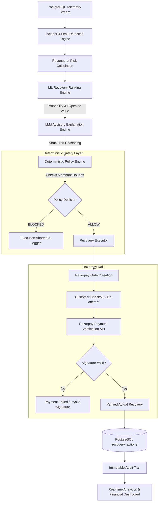

# RecoverX Sentinel
> **Turning payment failures from a dead end into a recovery decision.**

[](https://www.python.org/)
[](https://fastapi.tiangolo.com/)
[](https://react.dev/)
[](https://vitejs.dev/)
[](https://www.postgresql.org/)
[](https://razorpay.com/)
[](https://scikit-learn.org/)
[](LICENSE)

---

## 1. Executive Summary & Problem Statement

In modern digital commerce, **10% to 25% of legitimate customer transactions fail** at the payment gateway due to transient issues: bank issuer outages, network timeouts, payment method balance limitations, or customer authentication friction.

Traditionally, payment gateways treat failure as a binary, terminal event:
```
Customer Checkout ──► Failed Transaction ──► Abandoned Cart ──► Lost Revenue
```

### The Cost of Failed Recovery:
- **Revenue at Risk:** Millions in gross merchandise value (GMV) evaporate into lost conversions.
- **Blind Retries Backfire:** Blind, naive auto-retries cause card issuer spam flags, elevated gateway processing surcharges, and customer frustration.
- **Lack of Visibility:** Finance and engineering teams lack unified visibility into systemic revenue leaks across payment channels and geographic segments.

**RecoverX Sentinel** transforms payment failure into an autonomous, closed-loop financial operations system. It detects systemic payment degradation, runs predictive machine learning models to rank optimal recovery strategies, generates natural language explanations for operators, enforces deterministic policy guardrails, executes bounded recovery actions via **Razorpay**, and verifies actual ledger recovery with an immutable audit trail.

---

## 2. Solution Overview

RecoverX Sentinel acts as an autonomous revenue protection and recovery copilot for merchants:

1. **Continuous Telemetry & Incident Detection:** Continuously scans transactions in PostgreSQL to detect localized degradation patterns (e.g., *High-Value Card Degradation in Mumbai*, *UPI Degradation on Android in Bengaluru*).
2. **Revenue-at-Risk Quantification:** Aggregates transactions in affected segments to compute the precise financial exposure.
3. **ML Strategy Ranking:** Leverages trained classification and regression estimators to predict recovery probability and expected recovery across strategies (`ALTERNATIVE_PAYMENT`, `SMART_RETRY`, `DISCOUNT_INCENTIVE`, `CUSTOMER_OUTREACH`).
4. **Advisory LLM Reasoning:** Generates human-readable strategic rationales, root cause breakdowns, and trade-off comparisons with sub-second deterministic fallback resilience.
5. **Deterministic Policy Engine:** Enforces merchant-configured bounds (maximum retries, minimum expected recovery value, loss limits) as the un-bypassable gatekeeper before any action is executed.
6. **Bounded Execution & Verification:** Triggers compliant **Razorpay Orders**, provides instant test checkout routing, cryptographically verifies payments, and updates recovery states.
7. **Immutable Audit Trail:** Records every execution, cryptographic verification, and state transition to an immutable compliance log.

---

## 3. Core Architecture & Workflow

The end-to-end dataflow connects telemetry ingestion to cryptographic ledger verification:



---

## 4. Implementation Strategy: Layer-by-Layer

### 1. Data Ingestion & Relational Schema
All entities are modeled with strict foreign keys and relational integrity in PostgreSQL via SQLAlchemy:
- `merchants`: Merchant profile, default policy thresholds, and active status.
- `customers`: Customer history, lifetime value, and past payment success rates.
- `transactions`: Telemetry stream including payment method (`CARD`, `UPI`), bank issuer, amount, failure reason, city, and status.
- `revenue_leaks`: Grouped incident clusters with leak type, severity, and calculated revenue at risk.
- `recovery_actions`: Individual recovery executions tracking `status` (`EXECUTING`, `SUCCESS`, `FAILED`), `expected_recovery`, `actual_recovery`, and `razorpay_order_id`.
- `audit_logs`: Append-only compliance log tracking `RECOVERY_EXECUTED` and `RECOVERY_VERIFIED` events.

### 2. Incident Detection & Revenue at Risk
The detection engine queries transactions across sliding time windows and multidimensional segments. When failure rates exceed predefined baseline thresholds:
- Segments are flagged (e.g., `HIGH_VALUE_CARD_DEGRADATION` where failure rate > 30% on transactions > ₹5,000).
- **Revenue at Risk** is calculated as the sum of failed transaction amounts within the active degradation window.

### 3. Machine Learning Recovery Prediction
Trained scikit-learn models evaluate features including:
- Customer historical success rate
- Transaction amount and payment method
- Gateway error code and issuer response latency
- Time elapsed since failure and attempt number

The ML engine predicts:
- **Recovery Probability:** Statistical likelihood that the customer converts under a candidate strategy.
- **Expected Recovery:** Projected value calculated as $\text{Amount} \times \text{Recovery Probability}$.

Strategies are dynamically ranked by Expected Recovery value.

### 4. LLM Synthesis & Resilient Fallback
The LLM layer synthesizes a structured operational briefing:
- **Root Cause:** Identifies specific auth failure triggers.
- **Why This Strategy:** Justifies why an alternative rail (e.g., UPI) outperforms an immediate card retry.
- **Strategy Matrix:** Comparative table detailing probability, customer action required, and estimated time to recovery.
- **Dual-Mode Resilience:** If the external LLM proxy experiences latency (> 7 seconds), Sentinel automatically triggers the rule-based fallback model, setting `fallback_used: true` to prevent UI stalls while preserving 100% of ML rankings and policy decisions.

### 5. Deterministic Policy Engine (The Gatekeeper)
AI is never permitted to execute actions autonomously without deterministic validation. The Policy Engine enforces:
- Max retry bounds per customer/day
- Merchant minimum expected recovery floor
- Daily loss caps and risk tolerances
- Overdue cooldown intervals

### 6. Razorpay Integration & Payment Verification
When an operator triggers recovery:
1. `RazorpayClient` creates an authenticated order via Razorpay REST API (`POST /v1/orders`).
2. Order metadata references the failed transaction ID and amount.
3. The checkout portal (`test_payment.html`) handles test card and UPI simulation.
4. On completion, the backend verifies the payment signature against the merchant secret:
   $\text{HMAC-SHA256}(\text{order\_id} \parallel "|" \parallel \text{payment\_id}, \text{secret})$
5. Only upon cryptographic confirmation is the recovery action marked `SUCCESS` and counted toward `actual_recovered`.

---

## 5. Technology Stack

| Layer | Technologies | Role in Sentinel |
| :--- | :--- | :--- |
| **Frontend UI** | React 19, Vite 8, Lucide React | Apple/Linear-inspired fintech interface, responsive dark/light mode |
| **Design System** | Custom Vanilla CSS Design Tokens | High typography hierarchy, soft cards, zero layout shift |
| **Backend API** | Python 3.11+, FastAPI, Pydantic v2 | High-performance asynchronous API, CORS middleware, strict validation |
| **Database & ORM** | PostgreSQL 16, SQLAlchemy 2.0, Alembic | Relational storage, ACID transaction handling, migration management |
| **Machine Learning** | scikit-learn, NumPy, Pandas | Recovery probability estimation, expected recovery calculation |
| **AI / LLM** | FreeLLMAPI / Google Gemini, Requests | Structured advisory analysis with deterministic rule fallback |
| **Payment Rail** | Razorpay Test Mode API | Order generation, test payment simulation, HMAC-SHA256 signature verification |
| **Audit & Ops** | Append-only PostgreSQL Audit Trail | Idempotent event logging, immutable financial ledger records |

---

## 6. AI Architecture & Safety Boundaries

RecoverX Sentinel enforces strict separation of concerns between statistical prediction, language explanation, and execution authority:

```
┌─────────────────────────────────────────────────────────────────────────────┐
│                           AI SAFETY MATRIX                                  │
├───────────────────────┬───────────────────────┬─────────────────────────────┤
│ Component             │ Responsibility        │ Safety Boundary             │
├───────────────────────┼───────────────────────┼─────────────────────────────┤
│ ML Estimator          │ Statistical Ranking   │ Purely predictive; cannot   │
│                       │                       │ trigger actions.            │
├───────────────────────┼───────────────────────┼─────────────────────────────┤
│ LLM Reasoner          │ Human-readable        │ Strictly advisory; cannot   │
│                       │ Explanation           │ modify ML numbers.          │
├───────────────────────┼───────────────────────┼─────────────────────────────┤
│ Policy Engine         │ Final Authority       │ Hard deterministic code;    │
│                       │                       │ can veto AI recommendations.│
├───────────────────────┼───────────────────────┼─────────────────────────────┤
│ Recovery Executor     │ Bounded Actions       │ Only creates gated orders;  │
│                       │                       │ never touches raw cards.    │
├───────────────────────┼───────────────────────┼─────────────────────────────┤
│ Payment Verification  │ Actual Recovery Proof │ Recovery recorded ONLY      │
│                       │                       │ after cryptographic check.  │
└───────────────────────┴───────────────────────┴─────────────────────────────┘
```

> **Core Principle:** AI reasoning is advisory. Recovery actions remain subject to the deterministic policy engine and are counted as recovered only after payment verification.

---

## 7. Real-Time Production Metrics

The following metrics reflect actual operational records in RecoverX Sentinel's database:

| Metric | Recorded Value | Description |
| :--- | :--- | :--- |
| **Transactions Evaluated** | `5,000` | Ingested commerce telemetry records |
| **Active Revenue Leaks** | `3 Incidents` | High-Value Cards, UPI, Evening Peak |
| **Total Revenue at Risk** | **₹16,246,807.78** | Exposure across active degraded segments |
| **Projected Expected Recovery** | **₹153,653.88** | Statistical potential of actionable failures |
| **Verified Actual Recovered** | **₹117,421.44** | Cryptographically verified ledger recoveries |
| **Realized Recovery Rate** | **76.42%** | Actual Recovered / Expected Recovery efficiency |
| **Total Recovery Actions** | `5 Actions` | Bounded interventions executed |
| **Execution Outcomes** | `4 SUCCESS` · `1 PENDING` · `0 FAILED` | 80% direct terminal success |
| **Card Recovery Performance** | `4 Attempts` · `3 Won (75.0%)` | **₹110,819.93** recovered |
| **UPI Recovery Performance** | `1 Attempt` · `1 Won (100.0%)` | **₹6,601.51** recovered |

*Note: Incident attribution may overlap when a transaction matches multiple detected revenue-leak segments.*

---

## 8. End-to-End Demo Flow

```
1. Payment Failure Occurs
   └── Customer attempts ₹6,601.51 UPI transaction → Fails with "Insufficient Funds"

2. Incident Clustered
   └── Stream classifies failure under "UPI Degradation (Android / Bengaluru)"

3. Autonomous AI Incident Analysis
   ├── ML ranks ALTERNATIVE_PAYMENT #1 (68.27% probability, ₹4,506.54 expected recovery)
   ├── LLM outlines strategy comparison: Immediate prompt for secondary rail vs. retry
   └── Deterministic Policy Engine evaluates safety rules → Status: ALLOW

4. Recovery Execution
   └── Operator clicks "Execute Recovery" → Backend creates Razorpay Order (e.g. order_Qz...)

5. Customer Checkout Simulation
   └── Opens Razorpay Test Checkout portal with prefilled amount and transaction context

6. Cryptographic Verification & Audit
   ├── Backend verifies payment HMAC-SHA256 signature
   ├── recovery_actions status updated: EXECUTING ──► SUCCESS
   ├── actual_recovery updated to ₹6,601.51
   └── Immutable audit log appended: RECOVERY_VERIFIED
```

---

## 9. Engineering Challenges & Solutions

### 1. Unbounded LLM Latency & Hang Prevention
- **Challenge:** Free external LLM proxies occasionally stalled or took 60+ seconds to respond, leaving the UI stuck on *"Analyzing Event Stream..."*.
- **Solution:** Implemented strict request timeouts (7s primary, 5s fallback) with an automated deterministic fallback synthesis model (`fallback_used: true`). Added a 15-second frontend `AbortController` and guaranteed `finally` state cleanup.

### 2. Double-Execution & Webhook Idempotency
- **Challenge:** Network retries or repeated operator clicks could create duplicate Razorpay orders or record duplicate verified amounts.
- **Solution:** Implemented idempotency checks on `transaction_id` and unique constraints on `razorpay_order_id`, ensuring repeat verification calls return existing success records without modifying ledger totals.

### 3. Incident Attribution vs. Global Ledger Discrepancy
- **Challenge:** Transactions belonging simultaneously to multiple segments (e.g., High-Value Card + Evening Peak) caused segment action sums (6) to exceed global unique recovery actions (5).
- **Solution:** Maintained single source of truth in `recovery_actions` for financial KPIs while introducing explicit segment overlap attribution notices: *"Incident attribution may overlap when a transaction matches multiple detected revenue-leak segments."*

### 4. Zero Raw Markdown & XSS-Free Safe Rendering
- **Challenge:** AI analysis returned raw markdown tables, headers, and bold formatting that cluttered the interface or risked XSS if injected via unsanitized HTML.
- **Solution:** Developed `SafeMarkdownView` without `dangerouslySetInnerHTML`, parsing markdown tokens into native React UI elements with clean typography and zero raw syntax.

---

## 10. Repository Structure

```
Recovery-X-sentinel/
├── backend/
│   ├── app/
│   │   ├── main.py                  # FastAPI application & route registration
│   │   ├── database.py              # PostgreSQL engine & session lifecycle
│   │   ├── razorpay_client.py       # Razorpay API client & HMAC verification
│   │   ├── models/                  # SQLAlchemy ORM models
│   │   │   ├── merchant.py
│   │   │   ├── customer.py
│   │   │   ├── transaction.py
│   │   │   ├── revenue_leak.py
│   │   │   ├── recovery_action.py
│   │   │   └── audit_log.py
│   │   └── routes/                  # API routers
│   │       ├── analytics.py         # Aggregated financial KPIs & rail breakdown
│   │       ├── recovery.py          # Analyze & execute recovery workflows
│   │       ├── revenue_leaks.py     # Incident queries & risk telemetry
│   │       └── audit_logs.py        # Append-only compliance events
│   ├── requirements.txt             # Python dependencies
│   └── .env.example                 # Sanitized environment template
├── agent/
│   ├── recovery_agent.py            # ML ranking + LLM explanation orchestrator
│   └── llm_client.py                # Dual-mode resilient LLM client with fallback
├── ml/
│   ├── models/                      # Scikit-learn estimator definitions
│   └── training/                    # Model training pipelines & feature engineering
├── data/                            # Transaction generation scripts & test seeds
├── frontend/
│   ├── src/
│   │   ├── components/              # Shared UI components
│   │   │   ├── AIIncidentReport.jsx # Safe markdown parser & AI report layout
│   │   │   ├── KPICard.jsx          # Apple-inspired metric card
│   │   │   └── Sidebar.jsx          # Navigation drawer
│   │   ├── pages/                   # Application views
│   │   │   ├── Dashboard.jsx        # Risk monitor & recovery ring
│   │   │   ├── Incidents.jsx        # Leak analysis & execution drawer
│   │   │   ├── RecoveryActions.jsx  # Live recovery action ledger
│   │   │   ├── Analytics.jsx        # Incident & payment method performance
│   │   │   ├── AuditTrail.jsx       # Event timeline & compliance logs
│   │   │   └── Settings.jsx         # Merchant policy configuration
│   │   ├── services/api.js          # Resilient Axios/Fetch API client
│   │   └── index.css                # Custom design system tokens
│   ├── test_payment.html            # Razorpay Test Checkout portal
│   └── package.json
├── .gitignore                       # Strict security and cache exclusion
└── README.md                        # Master technical documentation
```

---

## 11. Quickstart & Installation

### Prerequisites
- **Python 3.11+**
- **Node.js 18+** & `npm`
- **PostgreSQL 14+**
- **Razorpay Test Account** ([dashboard.razorpay.com](https://dashboard.razorpay.com))

### 1. Backend Setup
```bash
# Clone the repository
git clone https://github.com/aswinofficial81/Recovery-X-sentinel.git
cd Recovery-X-sentinel

# Create & activate Python virtual environment
python -m venv .venv
# On Windows:
.venv\Scripts\activate
# On Linux/macOS:
source .venv/bin/activate

# Install dependencies
pip install -r backend/requirements.txt

# Configure environment variables
cp backend/.env.example backend/.env
# Edit backend/.env with your PostgreSQL credentials & Razorpay Test Keys

# Run backend server
uvicorn backend.app.main:app --host 0.0.0.0 --port 8000 --reload
```

### 2. Frontend Setup
```bash
# In a new terminal window
cd frontend

# Install Node dependencies
npm install

# Run Vite development server
npm run dev
```
Open **[http://localhost:5173](http://localhost:5173)** in your browser.

### 3. Environment Variables (`backend/.env.example`)
```env
# PostgreSQL Database Connection
DB_HOST=localhost
DB_PORT=5432
DB_NAME=recoverx_db
DB_USER=postgres
DB_PASSWORD=your_secure_password

# Razorpay Test Mode Credentials
RAZORPAY_KEY_ID=rzp_test_your_key_id
RAZORPAY_KEY_SECRET=your_test_secret_key

# Advisory AI Analysis (Optional)
FREELLMAPI_BASE_URL=http://localhost:3001/v1
FREELLMAPI_API_KEY=your_optional_api_key
FREELLMAPI_MODEL=gemini-3.6-flash
```

---

## 12. Future Roadmap

- **Autonomous Webhook Listener:** Automated ingress for production payment gateway webhooks (Stripe, Razorpay, PayU).
- **Multi-Rail Smart Routing:** Dynamic switching between acquirers based on real-time bank health telemetry.
- **Reinforcement Learning from Financial Feedback (RLFF):** Adapting recovery policy thresholds based on merchant margin sensitivity and chargeback ratios.
- **Customer WhatsApp Recovery Vectors:** Sending interactive one-click payment recovery prompts via official WhatsApp Business API.

---

## 13. License

Distributed under the **MIT License**. See `LICENSE` for more information.

---


