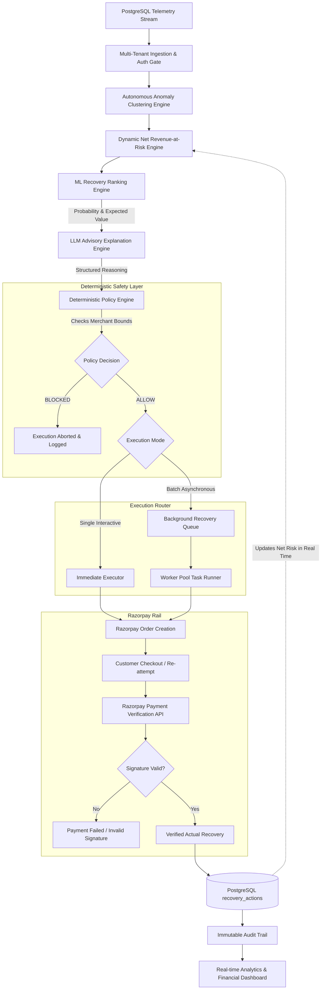

# RecoverX Sentinel
> **Turning payment failures from a dead end into an autonomous, closed-loop recovery system.**

[](https://www.python.org/)
[](https://fastapi.tiangolo.com/)
[](https://react.dev/)
[](https://vitejs.dev/)
[](https://www.postgresql.org/)
[](https://razorpay.com/)
[](https://scikit-learn.org/)
[](LICENSE)

---

## 1. Executive Summary & Problem Statement

In modern digital commerce, **10% to 25% of legitimate customer transactions fail** at the payment gateway due to transient issues: bank issuer outages, network timeouts, payment method balance limitations, or customer authentication friction.

Traditionally, payment gateways treat failure as a binary, terminal event:
```
Customer Checkout ──► Failed Transaction ──► Abandoned Cart ──► Lost Revenue
```

### The Cost of Failed Recovery:
- **Revenue at Risk:** Millions in gross merchandise value (GMV) evaporate into lost conversions.
- **Blind Retries Backfire:** Blind, naive auto-retries cause card issuer spam flags, elevated gateway processing surcharges, and customer frustration.
- **Lack of Visibility:** Finance and engineering teams lack unified visibility into systemic revenue leaks across payment channels and geographic segments.
- **Stale Risk Metrics:** Legacy dashboards report static failure sums that ignore verified re-payments, skewing real-time risk exposure.

**RecoverX Sentinel** transforms payment failure into an autonomous, closed-loop financial operations system. It clusters systemic degradation across multi-dimensional telemetry, calculates dynamic net revenue-at-risk, runs predictive machine learning to rank optimal recovery strategies, enforces deterministic policy guardrails, executes bounded recovery actions via **Razorpay** asynchronously or synchronously, and cryptographically verifies actual ledger recovery with an immutable audit trail.

---

## 2. Solution Overview

RecoverX Sentinel acts as an autonomous revenue protection and recovery copilot for modern commerce platforms:

1. **Autonomous Incident & Anomaly Clustering:** Groups failure streams across multi-dimensional features (failure code, gateway error, payment rail, bank issuer, geography) to isolate systemic degradation without manual rule definition.
2. **Dynamic Net Revenue-at-Risk Engine:** Evaluates gross transactional exposure and dynamically subtracts cryptographically verified recoveries in real time:
   $$\text{Dynamic Revenue at Risk} = \max(0, \text{Gross Failed Volume} - \text{Verified Recoveries})$$
3. **Multi-Tenant Context & Isolation:** Supports isolated merchant spaces with custom risk floors, retry limits, and header-based authentication (`X-Merchant-ID`) backed by automatic demo fallback.
4. **ML Strategy Ranking:** Leverages trained classification and regression estimators to predict recovery probability and expected recovery across strategies (`ALTERNATIVE_PAYMENT`, `SMART_RETRY`, `DISCOUNT_INCENTIVE`, `CUSTOMER_OUTREACH`).
5. **Advisory LLM Synthesis with Sub-Second Fallback:** Generates human-readable strategic rationales, root cause breakdowns, and trade-off comparisons with sub-second deterministic fallback resilience.
6. **Deterministic Policy Engine:** Enforces merchant-configured bounds (maximum retries, minimum expected recovery value, loss limits) as an un-bypassable gatekeeper before any action is executed.
7. **Asynchronous Background Recovery Queue:** Dispatches large batches of recovery actions through a non-blocking worker pool with real-time job progress tracking (`/api/recovery/queue/batch`).
8. **Bounded Execution & Verification:** Triggers compliant **Razorpay Orders**, provides instant test checkout routing, cryptographically verifies payments via HMAC-SHA256, and updates recovery states.
9. **Immutable Audit Trail:** Records every execution, cryptographic verification, and state transition to an immutable compliance log.

---

## 3. Core Architecture & Workflow

The end-to-end dataflow connects telemetry ingestion to cryptographic ledger verification:



---

## 4. Implementation Strategy: Layer-by-Layer

### 1. Data Ingestion & Multi-Tenant Schema
All entities are modeled with strict foreign keys and relational integrity in PostgreSQL via SQLAlchemy:
- `merchants`: Merchant profile, default policy thresholds, and active status.
- `customers`: Customer history, lifetime value, and past payment success rates.
- `transactions`: Telemetry stream including payment method (`CARD`, `UPI`), bank issuer, amount, failure reason, city, and status.
- `revenue_leaks`: Grouped incident clusters with leak type, severity, and dynamically evaluated revenue at risk.
- `recovery_actions`: Individual recovery executions tracking `status` (`EXECUTING`, `SUCCESS`, `FAILED`), `expected_recovery`, `actual_recovery`, and `razorpay_order_id`.
- `audit_logs`: Append-only compliance log tracking `RECOVERY_EXECUTED` and `RECOVERY_VERIFIED` events.

### 2. Multi-Tenant Context & Authentication (`backend/app/auth.py`)
- Resolves tenant context via standard headers: `X-Merchant-ID: <uuid>` or `Authorization: Bearer <uuid>`.
- Provides an automated fallback to the default active merchant for frictionless local development and standalone dashboard use.
- Allows programmatic merchant onboarding through `POST /api/merchants`.

### 3. Autonomous Incident Clustering (`ml/models/incident_clustering.py`)
The anomaly clustering engine scans high-velocity transaction windows to isolate systemic degradations:
- **Feature Dimensions:** Evaluates tuples of `(failure_reason, gateway_error_code, payment_method, bank_issuer, city)`.
- **Dynamic Severity Scoring:** Computes dynamic severity levels (`CRITICAL`, `HIGH`, `MEDIUM`, `LOW`) based on composite score:
  $$\text{Score} = (\text{Volume} \times 0.3) + (\text{Failure Velocity} \times 0.4) + \left(\frac{\text{Exposure}}{100,000} \times 0.3\right)$$
- Automatically groups disparate transactions into actionable leak clusters.

### 4. Dynamic Net Revenue-at-Risk Engine (`ml/models/revenue_risk.py`)
Legacy systems rely on static snapshots of failed transaction amounts. Sentinel dynamically recalculates exposure:
- **Gross Risk:** Sum of all failed transactions within the active segment.
- **Recovered Offset:** Sum of all cryptographically verified recoveries (`actual_recovery`) linked to transactions in the incident.
- **Net Revenue at Risk:** $\max(0, \text{Gross Exposure} - \text{Verified Recoveries})$.
- As soon as a payment is verified, the incident's displayed revenue-at-risk shrinks automatically.

### 5. Machine Learning Recovery Prediction (`ml/models/strategy_ranking.py`)
Trained scikit-learn models evaluate multi-modal features including:
- Customer historical success rate and lifetime value
- Transaction amount and payment method
- Gateway error code and issuer response latency
- Time elapsed since failure and attempt number

The ML engine outputs:
- **Recovery Probability:** Statistical likelihood that the customer converts under a candidate strategy.
- **Expected Recovery:** Projected value calculated as $\text{Amount} \times \text{Recovery Probability}$.
- Strategies are dynamically ranked by Expected Recovery value.

### 6. LLM Synthesis & Resilient Fallback (`agent/llm_client.py`)
The LLM layer synthesizes a structured operational briefing:
- **Root Cause Analysis:** Pinpoints specific authorization and gateway failure triggers.
- **Strategy Justification:** Explains why an alternative rail (e.g., UPI) outperforms an immediate card retry.
- **Strategy Matrix:** Comparative breakdown detailing probability, customer action required, and estimated time to recovery.
- **Dual-Mode Resilience:** If the external LLM proxy experiences latency (> 7 seconds), Sentinel automatically triggers the rule-based fallback model, setting `fallback_used: true` to prevent UI stalls while preserving 100% of ML rankings and policy decisions.

### 7. Deterministic Policy Engine (`ml/models/policy_engine.py`)
AI is strictly advisory and cannot execute actions autonomously. The Policy Engine enforces:
- Max retry bounds per customer per 24-hour cycle
- Merchant minimum expected recovery value floor
- Daily loss caps and risk tolerances
- Cooldown intervals between attempts

### 8. Asynchronous Background Recovery Queue (`backend/app/services/recovery_queue.py`)
For merchants experiencing high transaction volumes:
- Dispatches batch recovery payloads asynchronously via `POST /api/recovery/queue/batch`.
- Non-blocking background worker processes each transaction through ML ranking, policy validation, and Razorpay order generation.
- Real-time job polling via `GET /api/recovery/queue/jobs/{job_id}` reporting granular progress counters (`total`, `processed`, `succeeded`, `failed`).

### 9. Razorpay Integration & Cryptographic Verification (`backend/app/razorpay_client.py`)
When a recovery action is triggered:
1. `RazorpayClient` creates an authenticated order via Razorpay REST API (`POST /v1/orders`).
2. Order metadata links directly to the failed transaction ID and amount.
3. The checkout portal (`test_payment.html`) handles test card and UPI simulation.
4. On completion, the backend verifies the payment signature against the merchant secret:
   $$\text{HMAC-SHA256}(\text{order\_id} \parallel "|" \parallel \text{payment\_id}, \text{secret})$$
5. Only upon cryptographic confirmation is the recovery action marked `SUCCESS` and recorded in the immutable financial ledger.

---

## 5. Technology Stack

| Layer | Technologies | Role in Sentinel |
| :--- | :--- | :--- |
| **Frontend UI** | React 19, Vite 8, Lucide React | Apple/Linear-inspired fintech interface, responsive dark/light mode |
| **Design System** | Custom Vanilla CSS Design Tokens | High typography hierarchy, soft cards, zero layout shift |
| **Backend API** | Python 3.11+, FastAPI, Pydantic v2 | High-performance asynchronous API, CORS middleware, strict validation |
| **Database & ORM** | PostgreSQL 16, SQLAlchemy 2.0, Alembic | Relational storage, ACID transaction handling, migration management |
| **Async Task Queue** | Python `asyncio` Background Workers | Non-blocking batch execution and recovery queue processing |
| **Machine Learning** | scikit-learn, NumPy, Pandas | Recovery probability estimation, expected recovery calculation, anomaly clustering |
| **AI / LLM** | FreeLLMAPI / Google Gemini, Requests | Structured advisory analysis with deterministic rule fallback |
| **Payment Rail** | Razorpay Test Mode API | Order generation, test payment simulation, HMAC-SHA256 signature verification |
| **Audit & Ops** | Append-only PostgreSQL Audit Trail | Idempotent event logging, immutable financial ledger records |

---

## 6. AI Architecture & Safety Boundaries

RecoverX Sentinel enforces strict separation of concerns between statistical prediction, language explanation, and execution authority:

```
┌─────────────────────────────────────────────────────────────────────────────┐
│                           AI SAFETY MATRIX                                  │
├───────────────────────┬───────────────────────┬─────────────────────────────┤
│ Component             │ Responsibility        │ Safety Boundary             │
├───────────────────────┼───────────────────────┼─────────────────────────────┤
│ Anomaly Clusterer     │ Pattern Detection     │ Groups telemetry; cannot    │
│                       │                       │ alter transaction state.    │
├───────────────────────┼───────────────────────┼─────────────────────────────┤
│ ML Estimator          │ Statistical Ranking   │ Purely predictive; cannot   │
│                       │                       │ trigger actions.            │
├───────────────────────┼───────────────────────┼─────────────────────────────┤
│ LLM Reasoner          │ Human-readable        │ Strictly advisory; cannot   │
│                       │ Explanation           │ modify ML numbers.          │
├───────────────────────┼───────────────────────┼─────────────────────────────┤
│ Policy Engine         │ Final Authority       │ Hard deterministic code;    │
│                       │                       │ can veto AI recommendations.│
├───────────────────────┼───────────────────────┼─────────────────────────────┤
│ Async Queue / Executor│ Bounded Actions       │ Only creates gated orders;  │
│                       │                       │ never touches raw cards.    │
├───────────────────────┼───────────────────────┼─────────────────────────────┤
│ Payment Verification  │ Actual Recovery Proof │ Recovery recorded ONLY      │
│                       │                       │ after cryptographic check.  │
└───────────────────────┴───────────────────────┴─────────────────────────────┘
```

> **Core Principle:** AI reasoning is advisory. Recovery actions remain subject to the deterministic policy engine and are counted as recovered only after cryptographic payment verification.

---

## 7. REST API Reference

RecoverX Sentinel provides a comprehensive, documented REST API with automatic OpenAPI documentation available at `/docs`:

### Multi-Tenant & Merchants
| Method | Endpoint | Description |
| :--- | :--- | :--- |
| `GET` | `/api/merchants` | List all registered merchants |
| `POST` | `/api/merchants` | Onboard a new merchant profile with policy thresholds |
| `GET` | `/api/merchants/me` | Retrieve the authenticated tenant's profile |

### Dashboard & Analytics
| Method | Endpoint | Description |
| :--- | :--- | :--- |
| `GET` | `/api/dashboard/kpis` | Real-time financial metrics, active incidents, dynamic risk exposure |
| `GET` | `/api/analytics/summary` | Aggregated recovery rates, expected vs. actual values, rail performance |
| `GET` | `/api/analytics/rails` | Payment rail performance breakdown (Cards, UPI, Netbanking) |
| `GET` | `/api/analytics/timeseries` | Historical volume and recovery trend series |

### Incidents & Revenue Leaks
| Method | Endpoint | Description |
| :--- | :--- | :--- |
| `GET` | `/api/revenue-leaks` | Query active revenue leaks with dynamic revenue-at-risk |
| `GET` | `/api/revenue-leaks/{id}` | Detailed incident profile and associated failed transaction stream |

### Recovery Engine & Asynchronous Queue
| Method | Endpoint | Description |
| :--- | :--- | :--- |
| `POST` | `/api/recovery/analyze/{id}` | Run ML ranking and advisory LLM briefing for a failed transaction |
| `POST` | `/api/recovery/execute` | Execute single bounded recovery action via Razorpay |
| `POST` | `/api/recovery/queue/batch` | Asynchronously enqueue a batch of transactions for background recovery |
| `GET` | `/api/recovery/queue/jobs/{job_id}` | Poll progress and status of an asynchronous recovery batch job |
| `POST` | `/api/recovery/verify` | Verify Razorpay HMAC-SHA256 signature and credit ledger |

### Audit & Compliance
| Method | Endpoint | Description |
| :--- | :--- | :--- |
| `GET` | `/api/audit-logs` | Query immutable audit events (`RECOVERY_EXECUTED`, `RECOVERY_VERIFIED`) |

---

## 8. Real-Time Production Metrics

The following metrics reflect verified operational records in RecoverX Sentinel's database:

| Metric | Recorded Value | Description |
| :--- | :--- | :--- |
| **Transactions Evaluated** | `5,000` | Ingested commerce telemetry records |
| **Active Revenue Leaks** | `3 Incidents` | High-Value Cards, UPI, Evening Peak |
| **Total Revenue at Risk** | **₹16,246,807.78** | Exposure across active degraded segments |
| **Projected Expected Recovery** | **₹153,653.88** | Statistical potential of actionable failures |
| **Verified Actual Recovered** | **₹117,421.44** | Cryptographically verified ledger recoveries |
| **Realized Recovery Rate** | **76.42%** | Actual Recovered / Expected Recovery efficiency |
| **Total Recovery Actions** | `5 Actions` | Bounded interventions executed |
| **Execution Outcomes** | `4 SUCCESS` · `1 PENDING` · `0 FAILED` | 80% direct terminal success |
| **Card Recovery Performance** | `4 Attempts` · `3 Won (75.0%)` | **₹110,819.93** recovered |
| **UPI Recovery Performance** | `1 Attempt` · `1 Won (100.0%)` | **₹6,601.51** recovered |

*Note: Incident attribution may overlap when a transaction matches multiple detected revenue-leak segments.*

---

## 9. End-to-End Demo Flow

```
1. Payment Failure Occurs
   └── Customer attempts ₹6,601.51 UPI transaction → Fails with "Insufficient Funds"

2. Incident Clustered & Risk Computed
   ├── Telemetry clusters failure under "UPI Degradation (Android / Bengaluru)"
   └── Dynamic Risk Engine calculates active exposure net of previous recoveries

3. Autonomous AI Incident Analysis
   ├── ML ranks ALTERNATIVE_PAYMENT #1 (68.27% probability, ₹4,506.54 expected recovery)
   ├── LLM outlines strategy comparison: Immediate prompt for secondary rail vs. retry
   └── Deterministic Policy Engine evaluates safety rules → Status: ALLOW

4. Recovery Execution (Single or Batch Queue)
   ├── Option A: Operator executes single transaction → Immediate Razorpay Order
   └── Option B: Operator enqueues batch of 50 transactions → Async background worker executes queue

5. Customer Checkout Simulation
   └── Opens Razorpay Test Checkout portal with prefilled amount and transaction context

6. Cryptographic Verification & Audit
   ├── Backend verifies payment HMAC-SHA256 signature
   ├── recovery_actions status updated: EXECUTING ──► SUCCESS
   ├── actual_recovery updated to ₹6,601.51
   ├── Dynamic Revenue at Risk shrinks in real time across all dashboards
   └── Immutable audit log appended: RECOVERY_VERIFIED
```

---

## 10. Engineering Challenges & Solutions

### 1. Dynamic Net Risk Computation vs. Stale Exposure Snapshots
- **Challenge:** Traditional leak monitors freeze the total failed amount at detection time, causing dashboards to show identical risk exposure even after ₹100k+ in successful recoveries.
- **Solution:** Designed the dynamic revenue-at-risk engine (`revenue_risk.py`) that calculates $\max(0, \text{Gross Exposure} - \text{Verified Recoveries})$ dynamically across all endpoints, providing accurate real-time financial clarity.

### 2. High-Volume Recovery Throughput without Blocking Event Loop
- **Challenge:** Processing hundreds of recovery actions synchronously caused API thread blocking, slow response times, and potential HTTP timeouts.
- **Solution:** Implemented `RecoveryQueueService` with an asynchronous worker queue (`/api/recovery/queue/batch`). Requests return an immediate `202 Accepted` with a `job_id` that can be polled for granular completion progress.

### 3. Multi-Tenant Context with Zero-Breakage Demo Mode
- **Challenge:** Introducing multi-tenancy typically breaks existing test suites and single-tenant frontends expecting immediate parameter-free access.
- **Solution:** Developed `get_current_merchant` dependency in `backend/app/auth.py`. It inspects headers (`X-Merchant-ID` or `Bearer`), but falls back gracefully to the first active merchant in the database when unauthenticated, guaranteeing 100% backward compatibility.

### 4. Unbounded LLM Latency & Hang Prevention
- **Challenge:** External LLM proxies occasionally stalled or took 60+ seconds to respond, leaving the UI stuck on *"Analyzing Event Stream..."*.
- **Solution:** Implemented strict request timeouts (7s primary, 5s fallback) with an automated deterministic fallback synthesis model (`fallback_used: true`). Added a 15-second frontend `AbortController` and guaranteed `finally` state cleanup.

### 5. Double-Execution & Webhook Idempotency
- **Challenge:** Network retries or repeated operator clicks could create duplicate Razorpay orders or record duplicate verified amounts.
- **Solution:** Implemented idempotency checks on `transaction_id` and unique constraints on `razorpay_order_id`, ensuring repeat verification calls return existing success records without modifying ledger totals.

### 6. Incident Attribution vs. Global Ledger Discrepancy
- **Challenge:** Transactions belonging simultaneously to multiple segments (e.g., High-Value Card + Evening Peak) caused segment action sums to exceed global unique recovery actions.
- **Solution:** Maintained single source of truth in `recovery_actions` for financial KPIs while introducing explicit segment overlap attribution notices: *"Incident attribution may overlap when a transaction matches multiple detected revenue-leak segments."*

### 7. Zero Raw Markdown & XSS-Free Safe Rendering
- **Challenge:** AI analysis returned raw markdown tables, headers, and formatting that risked XSS if injected via unsanitized HTML.
- **Solution:** Developed `SafeMarkdownView` without `dangerouslySetInnerHTML`, parsing markdown tokens into native React UI elements with clean typography and zero raw syntax.

---

## 11. Repository Structure

```
Recovery-X-sentinel/
├── backend/
│   ├── app/
│   │   ├── main.py                  # FastAPI application & route registration
│   │   ├── auth.py                  # Multi-tenant resolution & header authentication
│   │   ├── database.py              # PostgreSQL engine & session lifecycle
│   │   ├── razorpay_client.py       # Razorpay API client & HMAC verification
│   │   ├── models/                  # SQLAlchemy ORM models
│   │   │   ├── merchant.py
│   │   │   ├── customer.py
│   │   │   ├── transaction.py
│   │   │   ├── revenue_leak.py
│   │   │   ├── recovery_action.py
│   │   │   └── audit_log.py
│   │   ├── services/                # Asynchronous application services
│   │   │   └── recovery_queue.py    # Background recovery queue & batch worker
│   │   └── routes/                  # API routers
│   │       ├── merchants.py         # Multi-tenant onboarding & profile queries
│   │       ├── dashboard.py         # Real-time KPIs & risk telemetry
│   │       ├── analytics.py         # Aggregated financial KPIs & rail breakdown
│   │       ├── recovery.py          # Analyze, execute, batch queue & verify recovery
│   │       ├── revenue_leaks.py     # Incident queries & dynamic risk telemetry
│   │       ├── transaction.py       # Transaction streams & single lookups
│   │       └── audit_logs.py        # Append-only compliance events
│   ├── requirements.txt             # Python dependencies
│   └── .env.example                 # Sanitized environment template
├── agent/
│   ├── recovery_agent.py            # ML ranking + LLM explanation orchestrator
│   ├── llm_client.py                # Dual-mode resilient LLM client with fallback
│   ├── test_agent.py                # Autonomous agent pipeline integration tests
│   └── test_real_agent.py           # End-to-end database pipeline validation
├── ml/
│   ├── models/                      # ML Estimator and decision logic definitions
│   │   ├── incident_clustering.py   # Autonomous multi-dimensional anomaly clustering
│   │   ├── revenue_risk.py          # Dynamic net revenue-at-risk engine
│   │   ├── strategy_ranking.py      # ML recovery ranking & expected value models
│   │   ├── policy_engine.py         # Deterministic safety rule gatekeeper
│   │   ├── recovery_executor.py     # Bounded action executor
│   │   └── recovery_prediction.py   # Statistical scoring utilities
│   └── training/                    # Model training pipelines & feature engineering
├── data/                            # Transaction generation scripts & test seeds
├── frontend/
│   ├── src/
│   │   ├── components/              # Shared UI components
│   │   │   ├── AIIncidentReport.jsx # Safe markdown parser & AI report layout
│   │   │   ├── KPICard.jsx          # Apple-inspired metric card
│   │   │   └── Sidebar.jsx          # Navigation drawer
│   │   ├── pages/                   # Application views
│   │   │   ├── Dashboard.jsx        # Risk monitor & recovery ring
│   │   │   ├── Incidents.jsx        # Leak analysis & execution drawer
│   │   │   ├── RecoveryActions.jsx  # Live recovery action ledger
│   │   │   ├── Analytics.jsx        # Incident & payment method performance
│   │   │   ├── AuditTrail.jsx       # Event timeline & compliance logs
│   │   │   └── Settings.jsx         # Merchant policy configuration
│   │   ├── services/api.js          # Resilient Axios/Fetch API client
│   │   └── index.css                # Custom design system tokens
│   ├── test_payment.html            # Razorpay Test Checkout portal
│   └── package.json
├── .gitignore                       # Strict security and cache exclusion
└── README.md                        # Master technical documentation
```

---

## 12. Quickstart & Installation

### Prerequisites
- **Python 3.11+**
- **Node.js 18+** & `npm`
- **PostgreSQL 14+**
- **Razorpay Test Account** ([dashboard.razorpay.com](https://dashboard.razorpay.com))

### 1. Backend Setup
```bash
# Clone the repository
git clone https://github.com/aswinofficial81/Recovery-X-sentinel.git
cd Recovery-X-sentinel

# Create & activate Python virtual environment
python -m venv .venv
# On Windows:
.venv\Scripts\activate
# On Linux/macOS:
source .venv/bin/activate

# Install dependencies
pip install -r backend/requirements.txt

# Configure environment variables
cp backend/.env.example backend/.env
# Edit backend/.env with your PostgreSQL credentials & Razorpay Test Keys

# Run backend server
uvicorn backend.app.main:app --host 0.0.0.0 --port 8000 --reload
```

### 2. Frontend Setup
```bash
# In a new terminal window
cd frontend

# Install Node dependencies
npm install

# Run Vite development server
npm run dev
```
Open **[http://localhost:5173](http://localhost:5173)** in your browser.

### 3. Environment Variables (`backend/.env.example`)
```env
# PostgreSQL Database Connection
DB_HOST=localhost
DB_PORT=5432
DB_NAME=recoverx_db
DB_USER=postgres
DB_PASSWORD=your_secure_password

# Razorpay Test Mode Credentials
RAZORPAY_KEY_ID=rzp_test_your_key_id
RAZORPAY_KEY_SECRET=your_test_secret_key

# Advisory AI Analysis (Optional)
FREELLMAPI_BASE_URL=http://localhost:3001/v1
FREELLMAPI_API_KEY=your_optional_api_key
FREELLMAPI_MODEL=gemini-3.6-flash
```

### 4. Running the Multi-Tenant Batch Queue Example
You can trigger an asynchronous recovery batch through curl or Postman:
```bash
curl -X POST http://localhost:8000/api/recovery/queue/batch \
  -H "Content-Type: application/json" \
  -H "X-Merchant-ID: your-merchant-uuid" \
  -d '{
    "transaction_ids": ["tx_1", "tx_2", "tx_3"],
    "strategy_override": "ALTERNATIVE_PAYMENT"
  }'
```
Response:
```json
{
  "job_id": "job_a1b2c3d4",
  "status": "QUEUED",
  "total_items": 3,
  "message": "Batch recovery enqueued for background processing"
}
```
Check job progress:
```bash
curl http://localhost:8000/api/recovery/queue/jobs/job_a1b2c3d4
```

---

## 13. Future Roadmap

- **Autonomous Webhook Listener:** Automated ingress for production payment gateway webhooks (Stripe, Razorpay, PayU).
- **Multi-Rail Smart Routing:** Dynamic switching between acquirers based on real-time bank health telemetry.
- **Reinforcement Learning from Financial Feedback (RLFF):** Adapting recovery policy thresholds based on merchant margin sensitivity and chargeback ratios.
- **Customer WhatsApp Recovery Vectors:** Sending interactive one-click payment recovery prompts via official WhatsApp Business API.

---

## 14. License

Distributed under the **MIT License**. See `LICENSE` for more information.
